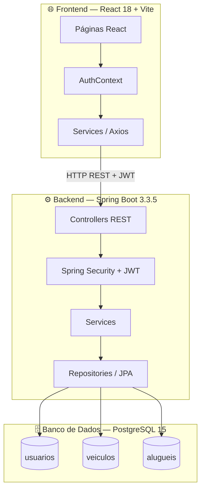
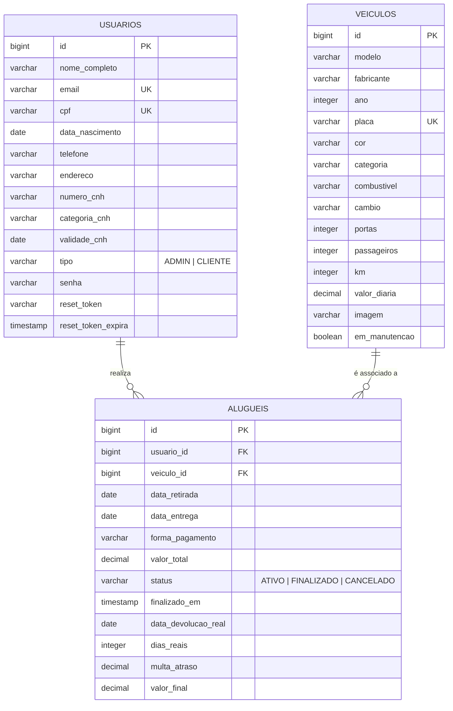
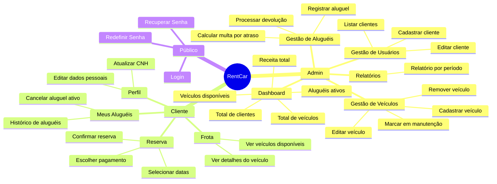
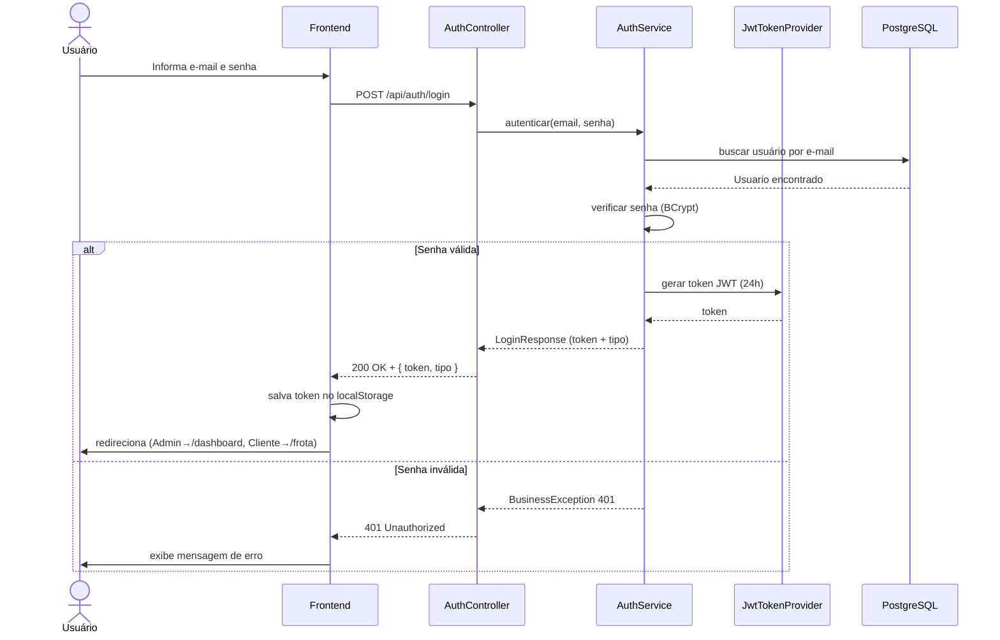
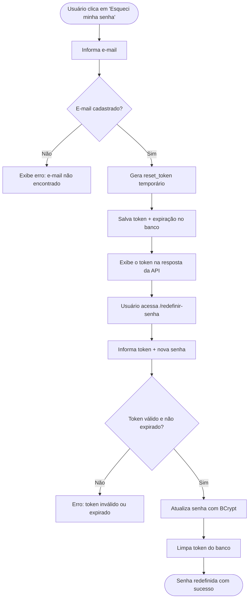
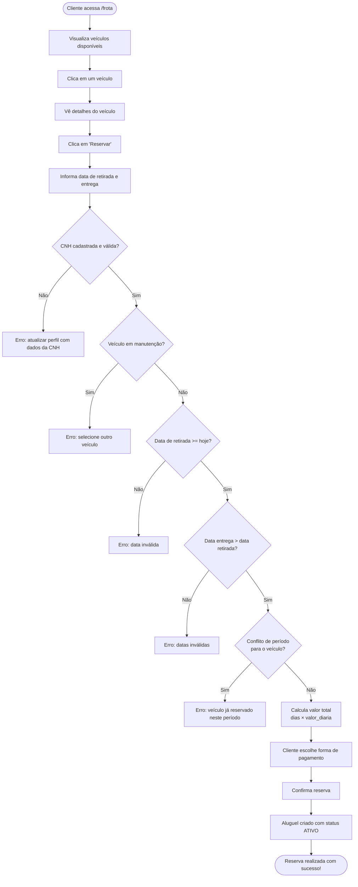
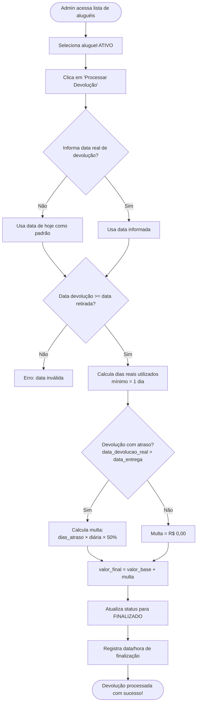
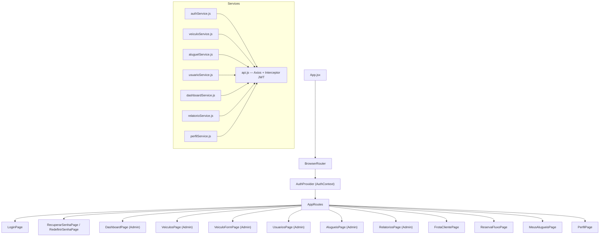

# 🚗 RentCar — Análise Completa do Sistema

> Sistema web completo para gerenciamento de locadoras de veículos, desenvolvido como projeto acadêmico da disciplina de **Projeto e Desenvolvimento de Software** (7º período — Sistemas de Informação).
> 
> **Equipe:** Aryane, Letícia, Lucas e Rafael  
> **Professor:** Drº Matheus Guedes

---

## 📋 Visão Geral

O **RentCar** é uma aplicação full-stack que gerencia todo o ciclo de vida de uma locadora de veículos: desde o cadastro de clientes e frota até o controle de aluguéis, devoluções e cálculo automático de multas por atraso.

---

## 🏗️ Arquitetura do Sistema

---

## 🗂️ Estrutura de Módulos do Backend

```mermaid
graph LR
    subgraph Features
        A[auth] --> A1[AuthController]
        A --> A2[AuthService]
        A --> A3[LoginRequest / Response]
        A --> A4[RecuperarSenhaRequest]
        A --> A5[RedefinirSenhaRequest]

        B[usuario] --> B1[UsuarioController]
        B --> B2[UsuarioService]
        B --> B3[PerfilController]
        B --> B4[TipoUsuario enum]
        B --> B5[UsuarioRepository]

        C[veiculo] --> C1[VeiculoController]
        C --> C2[VeiculoService]
        C --> C3[VeiculoRepository]

        D[aluguel] --> D1[AluguelController]
        D --> D2[AluguelService]
        D --> D3[AluguelRepository]
        D --> D4[StatusAluguel enum]

        E[dashboard] --> E1[DashboardController]
        E --> E2[DashboardService]

        F[relatorio] --> F1[RelatorioController]
        F --> F2[RelatorioService]
    end

    subgraph Common
        G[security] --> G1[JwtTokenProvider]
        G --> G2[JwtAuthenticationFilter]
        G --> G3[SecurityConfig]
        G --> G4[CustomUserDetailsService]
        H[exception] --> H1[BusinessException]
        H --> H2[GlobalExceptionHandler]
        I[validation] --> I1[CpfValidator]
        I --> I2[CnhValidator]
    end
```

---

## 🗃️ Diagrama de Entidades (Modelo de Dados)

---

## 👥 Perfis de Usuário e Funcionalidades

---

## 🔄 Fluxo de Autenticação (JWT)

---

## 🔑 Fluxo de Recuperação de Senha

---

## 🚗 Fluxo de Reserva de Veículo (Cliente)

---

## 📦 Fluxo de Devolução de Veículo (Admin)

---

## 🗺️ Mapa de Rotas do Frontend

```mermaid
graph TD
    subgraph Público
        R1["/login"]
        R2["/recuperar-senha"]
        R3["/redefinir-senha"]
    end

    subgraph Admin["🔐 Apenas Admin"]
        R4["/dashboard"]
        R5["/veiculos"]
        R6["/veiculos/novo"]
        R7["/veiculos/:id/editar"]
        R8["/usuarios"]
        R9["/usuarios/novo"]
        R10["/usuarios/:id/editar"]
        R11["/alugueis"]
        R12["/alugueis/novo"]
        R13["/relatorios"]
    end

    subgraph Compartilhado["👤 Admin + Cliente"]
        R14["/frota"]
        R15["/veiculos/:id"]
        R16["/reservar/:id"]
        R17["/meus-alugueis"]
        R18["/perfil"]
    end

    ROOT("/") -->|não autenticado| R1
    ROOT -->|Admin| R4
    ROOT -->|Cliente| R14
```

---

## 🔗 Diagrama de Componentes Frontend

---

## 📡 Endpoints da API REST

| Método | Rota | Acesso | Descrição |
|--------|------|--------|-----------|
| `POST` | `/api/auth/login` | Público | Autenticação e geração de token JWT |
| `POST` | `/api/auth/register` | Público | Registro de novo usuário |
| `POST` | `/api/auth/recuperar-senha` | Público | Solicita recuperação de senha |
| `POST` | `/api/auth/redefinir-senha` | Público | Redefine senha com token |
| `GET` | `/api/veiculos` | Autenticado | Listar todos os veículos |
| `POST` | `/api/veiculos` | Admin | Cadastrar novo veículo |
| `PUT` | `/api/veiculos/:id` | Admin | Editar veículo |
| `DELETE` | `/api/veiculos/:id` | Admin | Remover veículo |
| `GET` | `/api/usuarios` | Admin | Listar usuários |
| `POST` | `/api/usuarios` | Admin | Cadastrar usuário |
| `PUT` | `/api/usuarios/:id` | Admin | Editar usuário |
| `GET` | `/api/alugueis` | Admin | Listar todos os aluguéis |
| `POST` | `/api/alugueis` | Autenticado | Registrar aluguel |
| `POST` | `/api/alugueis/:id/devolver` | Admin | Processar devolução |
| `DELETE` | `/api/alugueis/:id` | Autenticado | Cancelar aluguel |
| `GET` | `/api/alugueis/usuario/:id` | Autenticado | Aluguéis de um usuário |
| `GET` | `/api/dashboard` | Admin | Estatísticas do dashboard |
| `GET` | `/api/relatorio` | Admin | Relatório de locações por período |
| `GET/PUT` | `/api/perfil` | Autenticado | Ver/editar perfil próprio |

---

## 🔐 Regras de Negócio Implementadas

| # | Regra | Descrição |
|---|-------|-----------|
| RF03 | Recuperação de senha | Token temporário com expiração de 15 minutos |
| RF06 | Manutenção de veículo | Veículo em manutenção não pode ser alugado |
| RF12 | Validação de CNH | CNH obrigatória com formato (11 dígitos) e validade verificados antes do aluguel |
| RF13 | Cálculo real | Cobra por dias efetivamente usados (mínimo 1 dia) |
| RF14 | Multa por atraso | 50% do valor da diária por dia excedente |
| — | Buffer entre aluguéis | Intervalo de 1 dia após cada devolução antes de nova reserva |
| — | Validação de CPF | CPF único por usuário com formato validado |
| — | Controle de acesso | Clientes só veem/modificam seus próprios dados e aluguéis |

---

## 🧮 Fórmula de Cálculo de Valores

### Valor base do aluguel:
$$\text{Valor Total} = \text{Valor Diária} \times \text{Dias Contratados}$$

### Cálculo na devolução (com ou sem atraso):
$$\text{Valor Base Real} = \text{Valor Diária} \times \max(\text{Dias Reais}, 1)$$

$$\text{Multa} = \text{Valor Diária} \times \text{Dias de Atraso} \times 0{,}5$$

$$\text{Valor Final} = \text{Valor Base Real} + \text{Multa}$$

---

## 🛠️ Stack Tecnológico Completo

| Camada | Tecnologia | Versão |
|--------|-----------|--------|
| **Frontend** | React | 18 |
| **Frontend** | Vite | 5 |
| **Frontend** | React Router DOM | 6 |
| **Frontend** | Tailwind CSS | 3 |
| **Frontend** | Axios | — |
| **Backend** | Java | 17+ |
| **Backend** | Spring Boot | 3.3.5 |
| **Backend** | Spring Security | — |
| **Backend** | Spring Data JPA | — |
| **Backend** | JWT (jjwt) | 0.12.6 |
| **Backend** | Maven | 3.6+ |
| **Banco** | PostgreSQL | 15+ |
